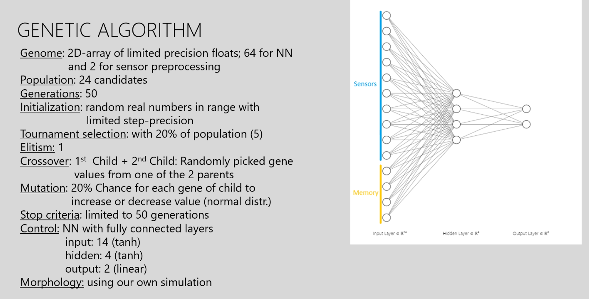
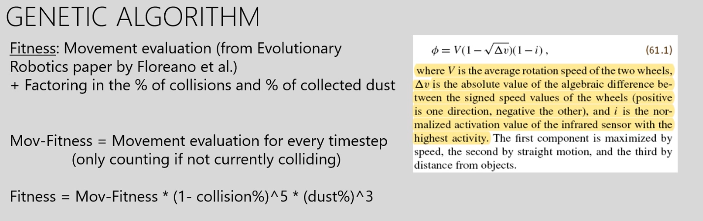
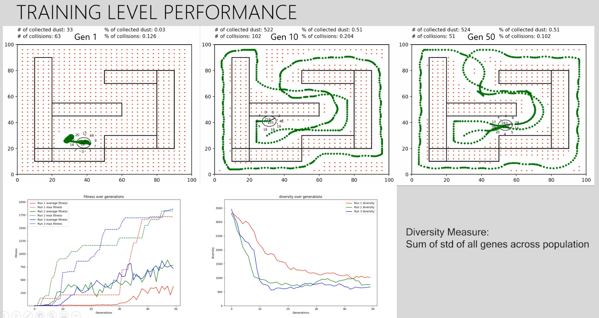

# NeuralNet-Roomba
Simulation of a roomba controlled through a Recurrent Neural Network optimized through a Genetic Algorithm


*Legacy project from Master's degree in A.I. @Maastricht University 03/2022. Graded 10/10. Collaboration with Shyngyskhan Abilkassov.*


### Genetic Algorithm & Neural Architecture



### Fitness Function



### Results




To run the simulation, run the following command in the terminal:
```bash
python3 main.py
```

To see a previously optimized roomba model in action, run the following command in the terminal:
```bash
python3 test_checkpoint.py
```


